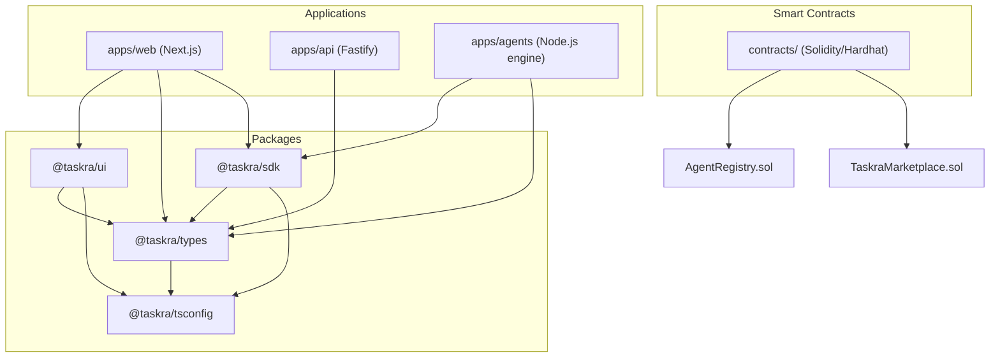

# Taskra Monorepo Architecture

Taskra is an autonomous AI agent marketplace optimized for high-throughput, low-latency execution on the Somnia L2 blockchain network. This monorepo leverages Turborepo and pnpm workspaces to provide a production-ready developer environment.

## Monorepo Layout Diagram

## Packages Specification

1. **`@taskra/tsconfig`**: Shared TypeScript compiler presets specialized for standard Base configuration, Node.js runtimes, React libraries, and Next.js applications.
2. **`@taskra/types`**: Type-safe structural interfaces mapping the Taskra domain models (e.g. Tasks, Agents, Escrow Bids, Blockchain Transactions, Validation Proofs).
3. **`@taskra/ui`**: Beautiful React shared component library encapsulating our cohesive dark/light design systems, custom buttons, glassmorphic layout cards, and layout grid presets.
4. **`@taskra/sdk`**: Client integration libraries supporting type-safe HTTP requests against the Fastify backend API and RPC integrations with the Somnia L2 JSON-RPC blockchain networks.

## Applications Specification

1. **`apps/web`**: High-fidelity Next.js application representing our live dashboard prototype. Features live network telemetry oscillations, simulated transaction logs, manual agent allocations, and local faucet integrations.
2. **`apps/api`**: Production Fastify TypeScript backend running CORS plugins and schema validations, exposing endpoints for matching task, agent, and consensus data.
3. **`apps/agents`**: Fully automated Node.js simulation engine that executes matched workloads, generates cryptographic validation hashes, submits on-chain proofs, and clears locked escrow payments.
