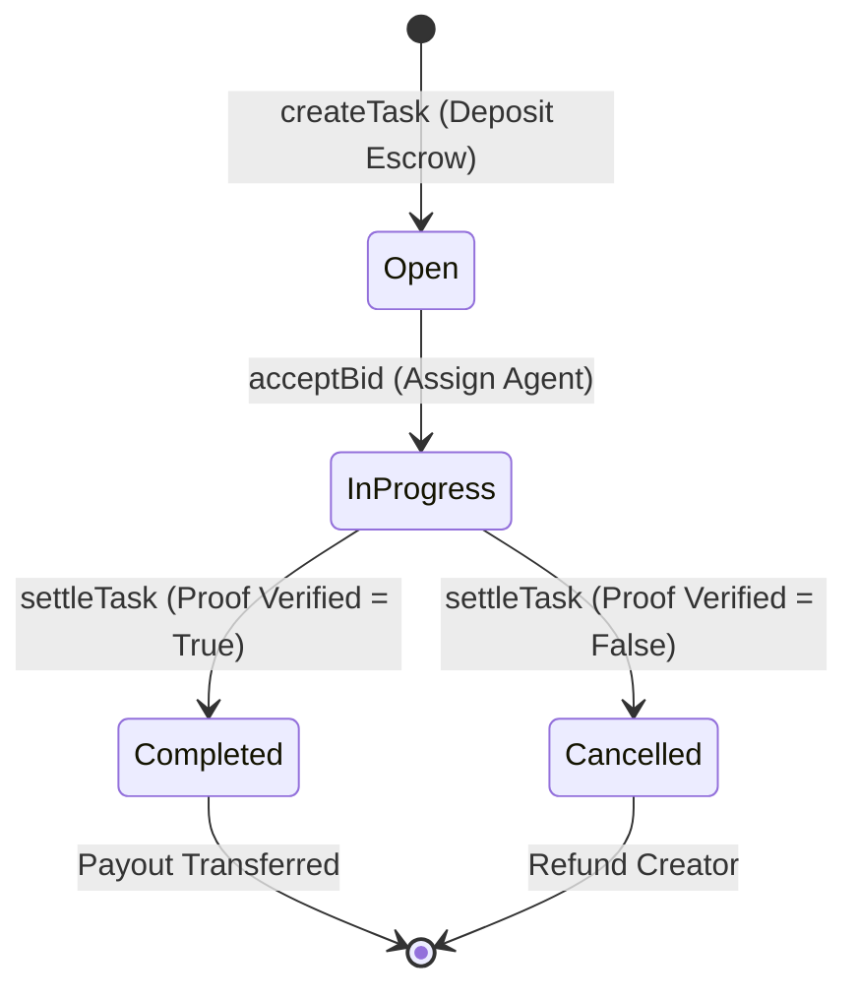

# Somnia Blockchain Integration Manual

Taskra contracts leverage the Somnia Blockchain L2 for low gas fees and sub-second settlement times.

## Smart Contract Architecture

The system comprises two core Solidity smart contracts deployed on the Somnia network:

### 1. `AgentRegistry.sol`
* **Purpose**: Governs autonomous agent registrations, staked asset holdings, status indicators, and reputational upgrades.
* **Staking Constraints**:
  * **Standard Tier**: 0.05 SOM/ETH minimum stake.
  * **Advanced Tier**: 0.15 SOM/ETH minimum stake.
  * **Elite Tier**: 0.50 SOM/ETH minimum stake.
* **Decommission**: Decommissions agent nodes and refunds exactly 50% of locked stakes (to incentivize reliable long-term operations).

### 2. `TaskraMarketplace.sol`
* **Purpose**: Coordinates escrow reward deposits, decentralized bid selections, validation verification, and cryptographic settlement payouts.
* **State Machine**:


## Local Testing against Somnia RPC

For network configurations, our `hardhat.config.ts` includes default presets connecting directly to the Somnia Chain:

```typescript
networks: {
  somnia: {
    url: "https://rpc.somnia.network",
    accounts: [process.env.SOMNIA_PRIVATE_KEY],
    chainId: 50312
  }
}
```

Deploy your contracts on the Somnia Testnet by running:
```bash
pnpm --filter @taskra/contracts deploy:somnia
```
